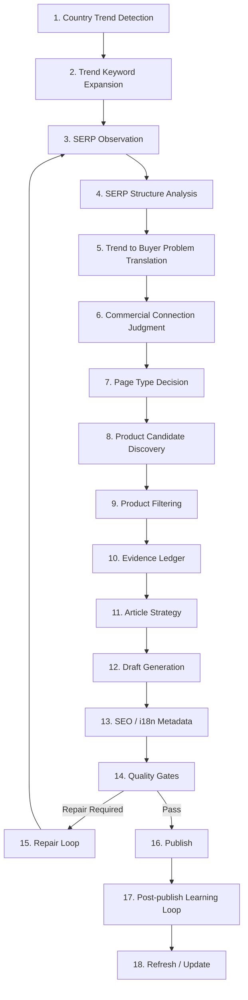

# Trend-to-Affiliate Publishing Pipeline v2.1

> 국가별 실시간 트렌드를 **검색자가 실제로 해결하려는 구매 판단 문제**로 번역하고, AliExpress / Temu / Amazon / iHerb / 현지몰 등으로 자연스럽게 연결하는 다국가 SEO 어필리에이트 사이트 운영 스펙.

- 작성일: 2026-06-29 KST
- 문서 목적: Codex/개발자/LLM 에이전트에게 전달 가능한 실행 스펙
- 핵심 방향: iGood식 **편집형 구매가이드 + 리뷰 패턴 분석 + 현지화된 buyer-decision page**
- 비목표: 단순 번역 팜, thin affiliate 자동 발행기, 테스트하지 않은 제품을 테스트한 척하는 리뷰 사이트

---

## 0. North Star Principle

```text
We do not publish one page per trend just because a trend exists.
We publish only when the trend can be translated into a concrete buyer decision with local availability, product evidence, repeated complaint patterns, and a clear user benefit.
```

한국어 운영 원칙:

```text
트렌드가 떴다는 이유만으로 글을 발행하지 않는다.
그 트렌드가 구체적인 구매 판단 문제로 번역되고,
현지 또는 글로벌 구매 가능성, 제품 근거, 반복 불만, 사용자 이득이 확인될 때만
색인 가능한 글로 발행한다.
```

이 사이트의 본질은 “트렌드 키워드에 제품 링크를 붙이는 것”이 아니다.  
검색자가 여러 탭을 열어야만 알 수 있는 정보를 한 페이지에서 판단 가능하게 압축하는 것이다.

---

## 1. Core Site Model

### 1.1 One Global Domain

초기 구조는 하나의 글로벌 도메인으로 간다.

```text
example.com/en/
example.com/en-us/
example.com/en-gb/
example.com/de-de/
example.com/fr-fr/
example.com/ko-kr/
example.com/ja-jp/
example.com/zh-tw/
...
```

국가별 도메인 분리는 하지 않는다.

```text
example-de.com
example-fr.com
example-kr.com
```

이런 식으로 쪼개면 도메인 신뢰, 내부링크, 브랜드 신호, Search Console 관리, 업데이트 루프가 전부 분산된다.  
또 “발행량이 많아 보이지 않게 숨기기 위해 여러 사이트를 만드는 구조”처럼 보이면 오히려 위험하다.

### 1.2 This Is Not a Translation Farm

이 사이트는 18개국에 같은 글을 번역해 뿌리는 구조가 아니다.

```text
국가별 트렌드 감지
→ 해당 국가/언어 검색자가 왜 찾는지 분석
→ 해당 검색자의 구매 문제로 번역
→ 해당 시장에서 접근 가능한 상품/판매처/배송/반품/리스크 정리
→ 현지화된 buyer-decision page 발행
```

같은 글로벌 이벤트라도 국가별 검색 의도는 달라질 수 있다.

예:

```text
/en-gb/trends/portable-ac-heatwave-2026/
영국 폭염 + 영국 가정/임대주택 + 230V + UK plug + Currys/Argos/Amazon UK

/de-de/trends/mobile-klimaanlage-hitzewelle-2026/
독일 Hitzewelle + mobile Klimaanlage + MediaMarkt/Saturn/Amazon.de + 독일식 창문

/ko-kr/trends/europe-heatwave-travel-cooling-products-2026/
한국에서 유럽 폭염이 이슈가 됐을 때: 유럽 여행 준비물, 항공 반입, 휴대용 선풍기, 냉감타월, 보조배터리
```

이 세 페이지는 같은 “폭염”을 다룰 수 있지만, 검색자와 구매 문제가 다르면 서로 다른 독립 글이다.

---

## 2. Publishing Volume / Multi-country SEO Policy

### 2.1 Publishing Volume

하루에 18개국 × 1개 글을 생성하는 것 자체는 자동으로 문제가 아니다.  
문제는 글 수가 아니라 **indexable page의 평균 품질**이다.

안전한 구조:

```text
Generated candidates: 많아도 됨
Drafts: 많아도 됨
Noindex repair-needed pages: 가능
Published indexable pages: 품질 게이트 통과분만
Sitemap: canonical + indexable URL만 포함
```

위험한 구조:

```text
트렌드 감지만 되면 자동 발행
모든 생성글 sitemap 포함
빈 국가/카테고리 페이지 index
상품 설명 재가공 + affiliate link만 삽입
국가명/통화만 바꾼 유사 페이지 대량 생성
```

### 2.2 Indexing Policy

Allowed:

- Generate many trend candidates.
- Generate drafts.
- Keep weak drafts `noindex`.
- Publish only pages that pass quality gates.
- Include only canonical, indexable URLs in sitemap.

Not allowed:

- Auto-index every generated article.
- Index empty country/category pages.
- Index tag/filter/search pages with no unique value.
- Index product redirect/API URLs.
- Publish translation-only versions without local buyer value.
- Publish near-duplicate pages where only country, currency, or retailer links changed.

### 2.3 Site-wide Quality Risk

한 도메인 안에 얇은 글이 많이 쌓이면 좋은 글도 같이 부담을 받을 수 있다.  
그래서 핵심 지표는 “하루 몇 개 발행했는가”가 아니라 다음이다.

```text
Indexable pages 중 완성된 현지화 buyer-decision page의 비율이 얼마나 높은가?
```

---

## 3. Multi-locale URL, Canonical, hreflang Policy

### 3.1 Fixed Locale URL Rule

각 페이지는 고정된 locale URL을 가진다.

Good:

```text
/ko-kr/trends/europe-heatwave-travel-cooling-products-2026/
/de-de/trends/mobile-klimaanlage-hitzewelle-2026/
/en-gb/trends/portable-ac-heatwave-2026/
```

Bad:

```text
/trends/portable-ac-heatwave-2026/
```

위 URL 하나에서 한국 IP면 한국어, 독일 IP면 독일어, 미국 IP면 영어를 보여주는 방식은 금지한다.

### 3.2 No IP/Cookie Language Switching for Main Content

같은 URL에서 IP, 쿠키, 브라우저 언어에 따라 본문 언어를 바꾸지 않는다.

대신 언어/국가 선택 배너를 제공한다.

```text
Reading from Germany? See the German guide.
한국어로 읽고 싶으신가요? 한국어 버전 보기.
```

강제 리다이렉트는 피하고, 사용자가 선택하게 한다.

### 3.3 Canonical Rule

각 indexable locale page는 자기 자신을 canonical로 둔다.

Good:

```html
<link rel="canonical" href="https://example.com/de-de/trends/mobile-klimaanlage-hitzewelle-2026/" />
```

Bad:

```html
<link rel="canonical" href="https://example.com/en/trends/portable-ac-heatwave-2026/" />
```

독일어 페이지가 영어 페이지를 canonical로 가리키면 독일어 페이지의 독립 색인 신호가 약해질 수 있다.

### 3.4 hreflang Rule

hreflang은 순위 부스터가 아니다.  
같은 core page의 언어/지역 변형을 Google에게 알려주는 교통정리 표지판이다.

#### hreflang 사용 조건

다음 조건이 모두 true일 때만 hreflang cluster를 만든다.

```text
1. 같은 core trend인가?
2. 같은 buyer decision인가?
3. 같은 page type인가?
4. 차이가 언어/지역 현지화인가?
5. 각 페이지가 indexable인가?
6. 각 페이지가 self-canonical인가?
7. 모든 variant가 reciprocal hreflang을 가질 수 있는가?
```

#### hreflang 가능 예시

```text
/en-us/trends/portable-ac-heatwave-2026/
미국 폭염 + 미국식 창문 + 115V + Amazon US / Walmart / Home Depot
BTU, SACC, dual-hose, return policy, large-room cooling 중심

/en-gb/trends/portable-ac-heatwave-2026/
영국 폭염 + 영국식 플러그 + 230V + Currys / Argos / Amazon UK
창문 배기 키트, 임대주택, 작은 방, De’Longhi/Meaco 중심

/de-de/trends/mobile-klimaanlage-hitzewelle-2026/
독일 Hitzewelle + mobile Klimaanlage + 220-240V + Amazon.de / MediaMarkt / Saturn / OBI
독일식 창문, 소음, Energieeffizienz, 반품/배송 중심

/fr-fr/trends/climatiseur-mobile-canicule-2026/
프랑스 canicule + climatiseur mobile + Darty / Boulanger / Leroy Merlin / Amazon.fr
프랑스 주택/임대/배송/AS/소음 중심
```

이 경우 같은 core buyer decision이다.

```text
폭염 상황에서 real portable AC / fan / evaporative cooler / accessory 중 무엇을 사야 하는가?
```

따라서 hreflang 가능.

예시:

```html
<link rel="alternate" hreflang="en-us" href="https://example.com/en-us/trends/portable-ac-heatwave-2026/" />
<link rel="alternate" hreflang="en-gb" href="https://example.com/en-gb/trends/portable-ac-heatwave-2026/" />
<link rel="alternate" hreflang="de-de" href="https://example.com/de-de/trends/mobile-klimaanlage-hitzewelle-2026/" />
<link rel="alternate" hreflang="fr-fr" href="https://example.com/fr-fr/trends/climatiseur-mobile-canicule-2026/" />
<link rel="alternate" hreflang="x-default" href="https://example.com/en/trends/portable-ac-heatwave-2026/" />
```

#### hreflang 제외 예시

```text
/ko-kr/trends/europe-heatwave-travel-cooling-products-2026/
한국인이 유럽 여행을 앞두고 준비할 냉방템, 항공 반입, 보조배터리 규정, 냉감타월, 숙소 에어컨 체크

/de-de/trends/mobile-klimaanlage-hitzewelle-2026/
독일 현지인이 자기 방에 둘 이동식 에어컨 구매

/fr-fr/trends/climatiseur-mobile-canicule-2026/
프랑스 현지인이 자기 집에 둘 이동식 에어컨 구매
```

같은 사건은 “유럽 폭염”이지만 buyer problem이 다르다.  
이 경우 한국어 페이지는 hreflang cluster에 묶지 않고 관련 내부링크로 연결한다.

### 3.5 Valid hreflang Codes

Good:

```text
en
en-us
en-gb
de-de
fr-fr
ko-kr
ja-jp
zh-tw
```

Avoid:

```text
en-eu
en-uk
EU
UK
country-only code without language
```

유럽 일반 영어 글은 보통 `hreflang="en"`으로 처리하고, 영국은 `en-gb`를 사용한다.

---

## 4. LLM vs Code/Schema Responsibilities

### 4.1 LLM = 판단하는 두뇌

LLM이 판단해야 하는 것:

- 이 트렌드가 어떤 구매 문제로 이어지는가?
- 상위 SERP가 왜 상위인지.
- 어떤 제품군을 연결해야 하는가.
- 어떤 글 각도가 이길 가능성이 있는가.
- 어떤 상품을 추천/제외해야 하는가.
- 리뷰 불만에서 진짜 반복 신호는 무엇인가.
- 페이지가 장황한가, 압축됐는가.
- hreflang cluster로 묶을 수 있는 같은 buyer-decision page인가.

### 4.2 Code/Schema = 안전벨트와 브레이크

코드와 스키마가 강제해야 하는 것:

- canonical 누락 금지.
- 잘못된 canonical 금지.
- affiliate disclosure 누락 금지.
- affiliate link에 `rel="sponsored nofollow"` 누락 금지.
- source URL 없는 상품 추천 금지.
- price checked date 없는 상품 카드 금지.
- evidence level 없는 상품 카드 금지.
- hreflang reciprocal 누락 금지.
- broken product link publish 금지.
- noindex draft sitemap 포함 금지.
- 같은 URL에서 locale별 본문 동적 변경 금지.
- product redirect/API URL index 금지.

이건 하드코딩 SEO가 아니라, LLM이 사고할 수 있는 안전한 레일이다.

---

## 5. Full Trend-to-Affiliate Pipeline



---

## 6. Pipeline Details

### 6.1 Country Trend Detection

For each locale:

- Collect trending keywords.
- Store country, locale, trend source, timestamp, trend velocity, related queries.
- Capture whether it is news, product, weather, fashion, event, health, tech, deal, or entertainment.

Output schema:

```json
{
  "country": "DE",
  "locale": "de-de",
  "trend_keyword": "Hitzewelle",
  "trend_context": "heatwave / cooling demand",
  "detected_at": "2026-06-29T00:00:00Z",
  "trend_velocity": "rising",
  "related_queries": ["mobile Klimaanlage", "Luftkühler", "Ventilator"]
}
```

### 6.2 Trend Keyword Expansion

LLM generates:

- exact trend keyword
- buyer-intent variants
- product-intent variants
- comparison variants
- risk/avoidance variants
- local marketplace variants

Example:

```text
Hitzewelle
mobile Klimaanlage
mobile Klimaanlage Test
Luftkühler oder Klimaanlage
mobile Klimaanlage Fenster Abdichtung
mobile Klimaanlage Amazon.de
mobile Klimaanlage MediaMarkt
```

### 6.3 SERP Observation

Use:

- Brave API
- SERP provider
- manual CSV
- optional browser-rendered inspection for dynamic pages

Collect top results for:

- exact trend keyword
- buyer-intent keyword
- product-intent keyword
- comparison keyword
- risk keyword

For each result extract:

- title
- meta description
- URL
- domain type
  - news
  - affiliate blog
  - magazine commerce
  - official store
  - marketplace
  - forum/community
  - video
- H1/H2/H3 structure
- product card pattern
- comparison table pattern
- affiliate link pattern
- FAQ
- update date
- evidence/test claims
- missing information

### 6.4 SERP Structure Analysis

LLM must answer:

```text
What search intent do the top pages satisfy?
Are top pages news, product guides, reviews, or official stores?
What page structures are common?
What information do top pages repeat?
What do top pages miss?
Is there an opening for a buyer-decision guide?
Is the SERP too official-store dominated?
Is the query worth creating a page for?
```

Output example:

```json
{
  "serp_opportunity": "medium_high",
  "winning_patterns": [
    "quick picks",
    "portable AC vs air cooler explanation",
    "comparison table",
    "retailer-specific availability"
  ],
  "serp_gaps": [
    "Few pages explain voltage/plug risk",
    "Few pages separate real compressor AC from evaporative coolers",
    "Few pages compare local retailers with global marketplaces"
  ]
}
```

### 6.5 Trend-to-Buyer-Problem Translation

LLM converts the trend into a concrete buyer problem.

Questions:

```text
Why is the user searching this now?
What are they afraid of buying wrong?
What products or accessories naturally solve this?
Is the best page a product list, buying guide, risk guide, or comparison?
What should the page explicitly warn against?
```

Example:

```json
{
  "trend": "Europe heatwave",
  "buyer_problem": "People are panic-buying cooling products and may confuse real compressor portable ACs with fans or evaporative coolers.",
  "page_angle": "Real portable AC picks, cooling accessories, and risky listings to avoid during heatwave shortages."
}
```

### 6.6 Commercial Connection Judgment

LLM evaluates monetization fit.

Check:

- AliExpress fit
- Temu fit
- Amazon fit
- iHerb fit
- local retailer need
- product availability
- shipping feasibility
- return feasibility
- voltage / plug / compatibility risk
- customs / cold-chain / expiry risk
- counterfeit risk
- YMYL / health claim risk

Output:

```json
{
  "commercial_fit_score": 82,
  "allowed_routes": ["Amazon", "AliExpress", "Temu"],
  "preferred_route": "Local Amazon or local retailer for heavy AC; AliExpress/Temu for accessories",
  "not_recommended": ["Heavy cross-border compressor AC with unclear voltage"],
  "reasoning": "Portable AC requires local voltage and bulky returns; accessories are better global marketplace candidates."
}
```

Important:

```text
Commercial fit score is advisory.
Hard gates still decide publishability.
```

### 6.7 Page Type Decision

LLM selects one primary page type:

| Code | Page Type | Use Case |
|---|---|---|
| A | Trend explainer + Top 10 practical picks | Trend naturally maps to products |
| B | Buying guide + comparison table | User needs decision criteria first |
| C | Deal / sale page | Event-driven shopping such as Prime Day |
| D | Fake/real or risk guide | Counterfeit, compatibility, voltage, safety, shipping risk |
| E | Accessory checklist | Main product is too risky/heavy, accessories are monetizable |
| F | Existing money page update | Trend should update an existing page instead of creating a new one |
| G | Research backlog | Trend exists but buyer problem/product evidence is not ready |

Do not force every trend into “Top 10 products.”

### 6.8 Product Candidate Discovery

Collect candidates from:

- AliExpress
- Temu
- Amazon
- iHerb
- local marketplaces where needed
- official manufacturer pages
- trusted third-party reviews
- community/review sources

For each product:

```text
exact product name
exact variant/model
marketplace URL
official spec URL if available
price
currency
price checked date
seller
shipping region
return terms
warranty route
product category
local compatibility notes
repeated complaints
review signals
```

### 6.9 Product Filtering

Remove or downgrade products with:

- unclear exact variant
- no reliable spec source
- no clear purchase route
- high return risk
- incompatible voltage/plug
- likely counterfeit risk
- unsupported health/medical claims
- insufficient reviews or evidence
- misleading title
- unsafe marketplace listing

Product classifications:

```text
Recommended
Conditional pick
Accessory only
Mention but do not recommend
Avoid
Insufficient evidence
```

### 6.10 Evidence Ledger

Every article must create an Evidence Ledger.

Schema:

```json
{
  "product_name": "...",
  "exact_variant": "...",
  "evidence_level": "B",
  "official_spec_source": "...",
  "marketplace_source": "...",
  "third_party_review_source": "...",
  "review_pattern_source": "...",
  "price": "...",
  "currency": "...",
  "price_checked_at": "2026-06-29",
  "region_availability": "...",
  "best_for": "...",
  "skip_if": "...",
  "repeated_complaints": ["...", "..."],
  "local_risk_note": "...",
  "affiliate_url": "...",
  "link_rel": "sponsored nofollow"
}
```

Evidence levels:

| Level | Meaning | Publish Use |
|---|---|---|
| A | Direct use / direct photos / usage period available | Strong recommendation possible |
| B | Review-backed + official specs + marketplace data | Normal recommendation possible |
| C | Specs-first comparison only | Conditional mention, lower confidence |
| D | Insufficient evidence | Do not recommend |

### 6.11 Article Strategy

LLM decides how to beat the SERP.

Must answer:

```text
What is the title angle?
What is the quick answer?
What is the main buyer warning?
What is the SERP gap?
What products belong in Top 10?
What should be excluded?
What comparison fields matter?
What FAQ queries should be included?
What internal links should be added?
```

### 6.12 Draft Generation

Article must use modular blocks:

```text
1. H1
2. Affiliate disclosure
3. Trend signal box
4. Quick answer
5. Buyer-problem translation
6. Marketplace rule
7. Top 10 practical picks
8. Quick comparison table
9. How to choose
10. Product-by-product notes
11. Buying risks
12. What to avoid
13. FAQ
14. Methodology note
15. Update log
```

Writing rule:

```text
Long is allowed.
Verbose is not allowed.
Every block must answer a concrete buyer decision.
```

---

## 7. Article Block Requirements

### 7.1 Trend Signal Box

Must answer:

```text
What trend was detected?
Where was it detected?
When was it detected?
Why does it matter now?
What buying behavior does it trigger?
```

Example:

```markdown
## Trend signal

- Locale: DE / de-de
- Trend: Hitzewelle
- Trigger: rising heatwave searches and cooling product interest
- Buyer risk: panic-buying weak air coolers or wrong-voltage cross-border AC units
- Article response: separate real compressor portable ACs from fans, evaporative coolers, and accessories
```

### 7.2 Quick Answer

Must give a useful answer within 10 seconds.

Example:

```markdown
## Quick answer

If you need to cool an actual room, look for a real compressor portable AC with an exhaust hose, clear SACC/DOE or local cooling capacity, and a return path you can use locally. Fans, evaporative coolers, and USB mini coolers may help with comfort, but they are not substitutes for compressor AC.
```

### 7.3 Marketplace Rule

Every global marketplace article must explain where each marketplace fits.

Example:

```markdown
## Marketplace rule

For heavy compressor AC units, prefer local Amazon/local retailers because voltage, plug, warranty, and bulky returns matter. AliExpress and Temu are better for accessories such as window seals, replacement hoses, adapters, small fans, and cooling helpers. iHerb should be used only where the category naturally fits and health claims can be kept conservative.
```

### 7.4 Product Card Required Fields

Each product card must include:

```text
product name
exact variant/model
price + currency
price checked date
evidence level
best for
skip if
key check
repeated complaints
local availability
warranty/return/shipping note
affiliate CTA
source stack
```

Recommended UI structure:

```markdown
### 1. Product Name — Best for [specific use]

**Quick verdict:** ...

**Best for:** ...  
**Skip if:** ...  
**Evidence level:** B — review-backed + official specs + marketplace data  
**Price checked:** 2026-06-29  
**Key check:** ...

**Repeated complaints to verify before buying**
- ...
- ...
- ...

**Source stack**
- Official spec: ...
- Marketplace: ...
- Review signal: ...
```

### 7.5 Comparison Table Required Fields

Comparison table fields should be category-specific.

For portable cooling:

```text
Rank
Product
Region fit
Real compressor AC / fan / evaporative cooler / accessory
Cooling capacity
Hose type
Voltage / plug
Noise
Room size
Return risk
Evidence level
Best for
Skip if
Price checked
Action
```

For supplements/iHerb:

```text
Product
Country availability
Ingredient / form
Dose per serving
Allergen flags
Storage/shipping risk
Claim limitation
Evidence level
Best for
Skip if
Price checked
Action
```

For fashion/accessories:

```text
Product
Material
Size/fit risk
Review sizing pattern
Return route
Counterfeit risk
Best for
Skip if
Evidence level
Price checked
Action
```

---

## 8. Quality Gate System

Quality gates are not final rejection walls.  
They are repair engines.

Gate result must not be only `PASS/FAIL`.  
It must return blockers and repair instructions.

### 8.1 Gate Status Values

```text
PASS
REPAIR_REQUIRED
HOLD_SOURCE_INSUFFICIENT
HOLD_HREFLANG_INCOMPLETE
HOLD_LEGAL_OR_YMYL_REVIEW
```

Important:

```text
HOLD does not mean abandon.
HOLD means the page must not be indexable until the repair loop resolves the blocker.
```

### 8.2 Hard Gate

Any failure blocks publishing until repaired.

- Body language and URL locale mismatch.
- Canonical missing.
- Canonical points to the wrong locale.
- Affiliate disclosure missing.
- Affiliate links missing `rel="sponsored nofollow"`.
- Product link broken.
- Recommended product has no source.
- Product card has no price checked date.
- Product card has no evidence level.
- Direct-use claim without direct-use proof.
- Same URL dynamically serves different language main content.
- `noindex` page included in sitemap.
- Product redirect/API URL is indexable.
- hreflang reciprocal cluster broken.

### 8.3 Repair Gate

Failure generates repair tasks.

- Local fit weak.
- Product candidate pool too weak.
- Repeated complaints too generic.
- Comparison table missing key decision fields.
- Top 10 includes weak evidence products.
- SERP gap not addressed.
- Article too verbose.
- FAQ too thin.
- Product descriptions too close to marketplace descriptions.
- Similarity with another locale page too high.
- Marketplace risk not explained.

### 8.4 LLM Editorial Gate

LLM must judge:

```text
Is this useful beyond merchant descriptions?
Does this page make the buyer’s decision easier?
Is the trend-to-product connection natural?
Would a reader understand what to buy and what to avoid?
Are product recommendations differentiated?
Does it avoid pretending to test products?
Is the article modular and not verbose?
```

### 8.5 Similarity / Doorway Guard

Before publishing, compare against existing articles.

Danger pattern:

```text
same products
same explanation
same complaints
same CTAs
only country/currency/retailer changed
```

Safe pattern:

```text
same core trend
but localized buyer problem
localized products or routes
localized risks
localized keywords
localized review signals
localized retailers/shipping/return notes
```

Decision:

```json
{
  "similarity_risk": "medium",
  "doorway_risk": "low",
  "reason": "The pages share the heatwave topic but differ in voltage, retailers, window-fit risks, and user intent.",
  "required_repairs": []
}
```

### 8.6 Thin Affiliate Guard

Affiliate pages must not copy merchant descriptions or reviews.

Each product block must add value through:

- price context
- product comparison
- buyer risk
- repeated complaints
- best for / skip if
- local availability
- warranty / return / shipping notes
- exact variant clarification
- avoid/conditional recommendation when needed

---

## 9. Repair Loop

### 9.1 Repair Loop Principle

Gate failure does not mean discard.

```text
Gate finds blockers
→ Repair Planner creates tasks
→ Research Collector gathers missing evidence
→ Product list may be replaced
→ Draft is revised
→ Gate runs again
→ Repeat until PASS or HOLD awaiting evidence/source
```

### 9.2 Repair Instruction Schema

```json
{
  "status": "REPAIR_REQUIRED",
  "blockers": [
    {
      "type": "LOCAL_FIT_MISSING",
      "severity": "hard",
      "message": "Germany page mentions portable AC but lacks German retailers, German plug/voltage notes, and German window-fit concerns.",
      "repair_action": "Collect Amazon.de, MediaMarkt, Saturn, and OBI availability. Add 220-240V and German window compatibility section."
    },
    {
      "type": "EVIDENCE_WEAK",
      "severity": "hard",
      "message": "3 products have no official spec source.",
      "repair_action": "Fetch official manufacturer pages or replace products."
    },
    {
      "type": "THIN_AFFILIATE_RISK",
      "severity": "repair",
      "message": "Product descriptions resemble marketplace descriptions and do not add repeated complaint patterns.",
      "repair_action": "Add review-pattern summary, best-for, skip-if, and buyer-risk note for each product."
    }
  ],
  "next_step": "RUN_RESEARCH_REPAIR_LOOP"
}
```

### 9.3 Repair Loop Outputs

Each repair pass must output:

- What changed.
- Which blockers were resolved.
- Which blockers remain.
- Whether new blockers appeared.
- Whether page can be indexable.

---

## 10. New Article Pipeline vs Existing Article Update Pipeline

### 10.1 New Article Pipeline

New articles do not have Search Console data yet.

```text
Trend detection
→ Keyword expansion
→ SERP analysis
→ Product discovery
→ Evidence Ledger
→ Draft
→ Gate
→ Repair loop
→ Publish
```

### 10.2 Existing Article Update Pipeline

Search Console belongs mainly here.

```text
Search Console performance check
→ indexed status
→ impressions
→ queries
→ CTR
→ buyer-intent query discovery
→ product candidates refreshed
→ comparison table updated
→ FAQ expanded
→ Top picks reordered
→ update log written
→ republish
```

### 10.3 Update Triggers

Update existing article when:

- New trend spike appears in related query.
- Search Console shows impressions but low CTR.
- Query set reveals missing section.
- Product is out of stock.
- Product price changed significantly.
- Product evidence improved/weakened.
- Affiliate link breaks.
- Locale-specific buying route changes.

---

## 11. International SEO Metadata Generation

For every indexable page generate:

```json
{
  "locale": "de-de",
  "url": "https://example.com/de-de/trends/mobile-klimaanlage-hitzewelle-2026/",
  "title": "Mobile Klimaanlage bei Hitzewelle 2026: echte Kühlung, Risiken und praktische Picks",
  "meta_description": "...",
  "canonical": "https://example.com/de-de/trends/mobile-klimaanlage-hitzewelle-2026/",
  "robots": "index,follow",
  "hreflang_cluster_id": "heatwave-portable-ac-2026",
  "sitemap_include": true,
  "schema_types": ["Article", "ItemList", "FAQPage"]
}
```

Rules:

- Canonical must self-reference.
- Sitemap include only if indexable and canonical.
- hreflang cluster only if reciprocal variants are complete.
- Locale URL must match body language and target market.

---

## 12. Affiliate Link Policy

### 12.1 Link Qualification

All affiliate links must use:

```html
<a href="AFFILIATE_URL" rel="sponsored nofollow" target="_blank">View price</a>
```

### 12.2 Redirect/API Link Rule

Product click tracking must not make the purchase link fragile.

Good:

```html
<a href="https://merchant.example/product" rel="sponsored nofollow" data-click-id="...">View price</a>
```

Analytics may run separately.

Bad:

```html
<a href="/api/affiliate-click?id=123">View price</a>
```

If `/api/affiliate-click` fails, user loses the purchase path.  
If such API URLs exist, mark them `noindex` and keep them out of sitemap.

### 12.3 Marketplace Route Notes

For global marketplaces:

```text
Amazon: generally useful for local availability, heavy items, easier returns in supported regions.
AliExpress / Temu: useful for small accessories, replacement parts, low-cost items; risky for heavy appliances, voltage-sensitive electronics, bulky returns.
iHerb: useful for health/beauty/food categories, but claims must be conservative and compliant.
Local retailers: needed when voltage, plug, warranty, bulky return, or cold-chain matters.
```

---

## 13. YMYL / Regulated Category Gate

Especially for iHerb or health-adjacent trends:

Hard restrictions:

- Do not claim disease treatment, cure, diagnosis, or prevention unless supported by authoritative medical/regulatory sources and framed properly.
- Do not make unsupported supplement efficacy claims.
- Include “who should avoid / ask a professional” where relevant.
- Separate “ingredient explanation” from “product recommendation.”
- Avoid risky categories that cannot be safely or legally promoted in target markets.

Health product card must include:

```text
ingredient/form
dose per serving
label claim source
allergen flags
storage/shipping risk
country availability
claim limitation
best for / skip if
evidence level
```

If medical safety uncertainty is high:

```text
Page type should become an informational checklist, not a Top 10 product push.
```

---

## 14. Launch Cadence

### 14.1 Early Phase

```text
Generate many candidates.
Publish fewer, stronger pages.
Increase publishing volume only after indexation and quality metrics stabilize.
```

Recommended early pattern:

```text
Daily candidates: 18+ possible
Indexable publishes: strongest 3~5 initially
Remaining: draft/noindex/repair queue
```

### 14.2 Mature Phase

Long term:

```text
18 indexable posts/day is acceptable only if every post passes the quality gate.
```

The goal is not to look small.  
The goal is to keep the indexable page average quality high.

---

## 15. Agent Roles

### 15.1 TrendScout

- Detects country-specific trends.
- Produces trend candidates.
- Adds freshness, velocity, related queries.

### 15.2 SERPAnalyst

- Reads top SERP results.
- Classifies winning page structures.
- Finds gaps.

### 15.3 BuyerProblemMapper

- Converts trend into buyer problem.
- Decides whether product connection is natural.

### 15.4 CommercialFitJudge

- Scores Ali/Temu/Amazon/iHerb/local fit.
- Flags shipping, return, voltage, customs, YMYL, counterfeit risk.

### 15.5 ProductScout

- Finds candidate products.
- Removes duplicates.
- Collects exact variants.

### 15.6 EvidenceBuilder

- Builds Evidence Ledger.
- Assigns evidence level.
- Requires official specs and marketplace source.

### 15.7 StrategyEditor

- Decides page type, title, SERP gap, Top 10 logic.

### 15.8 DraftWriter

- Produces modular article.
- Avoids verbose generic prose.
- Does not claim direct testing without proof.

### 15.9 Gatekeeper

- Runs hard gate, repair gate, editorial gate, hreflang gate, similarity gate.

### 15.10 RepairPlanner

- Converts blockers into repair tasks.
- Sends tasks back to collectors/writer.

### 15.11 Publisher

- Publishes only passed pages.
- Updates sitemap.
- Ensures canonical, robots, schema, affiliate link policy.

### 15.12 UpdateRunner

- Uses Search Console after publish.
- Updates old pages based on real queries and product changes.

---

## 16. Definition of Done

A page is publishable only when all are true:

```text
[ ] Trend signal is real and recorded.
[ ] Buyer problem is concrete.
[ ] Commercial connection is natural.
[ ] Locale URL matches body language and target market.
[ ] Article has local or globally accessible buying route.
[ ] Each recommended product has Evidence Ledger entry.
[ ] Each product has exact variant/model where possible.
[ ] Each product has price checked date.
[ ] Each product has evidence level.
[ ] Each product has best for / skip if.
[ ] Repeated complaints are product-specific, not generic filler.
[ ] Comparison table uses category-specific decision fields.
[ ] Affiliate disclosure exists near top.
[ ] Affiliate links use rel="sponsored nofollow".
[ ] Direct testing is not claimed unless evidence exists.
[ ] Canonical self-references.
[ ] hreflang cluster is valid or absent.
[ ] Sitemap includes only canonical indexable URL.
[ ] Draft/noindex/API/tag/search/filter URLs are excluded from sitemap.
[ ] Similarity/doorway risk is low or repaired.
[ ] Thin affiliate risk is low or repaired.
[ ] Page has update log.
```

---

## 17. Developer Implementation Checklist

### 17.1 Database Tables / Collections

Recommended entities:

```text
TrendCandidate
KeywordVariant
SERPResult
SERPStructureReport
BuyerProblemMap
CommercialFitReport
ProductCandidate
EvidenceLedgerItem
ArticleStrategy
ArticleDraft
QualityGateResult
RepairTask
PublishedArticle
SearchConsoleSnapshot
ArticleUpdateLog
HreflangCluster
```

### 17.2 Required Flags

```text
is_indexable
is_canonical
canonical_url
robots_directive
sitemap_include
locale
body_language
hreflang_cluster_id
evidence_level
affiliate_disclosure_present
affiliate_links_qualified
has_direct_use_claim
has_direct_use_evidence
similarity_score
thin_affiliate_risk
doorway_risk
repair_status
```

### 17.3 Publish Blockers

Do not publish indexable page if any are true:

```text
missing canonical
wrong canonical
missing disclosure
unqualified affiliate links
broken product links
recommended product without source
missing price checked date
missing evidence level
language-locale mismatch
unsupported direct-test claim
invalid hreflang cluster
sitemap includes noindex URL
high doorway/similarity risk unresolved
```

---

## 18. Policy Reference Notes

Use official Google documentation as implementation reference.

- Google Search Central — Spam Policies: scaled content abuse, doorway abuse, link spam, affiliate links with `nofollow` or `sponsored`.
  - https://developers.google.com/search/docs/essentials/spam-policies
- Google Search Central — Localized Versions / hreflang.
  - https://developers.google.com/search/docs/specialty/international/localized-versions
- Google Search Central — Managing Multi-regional and Multilingual Sites.
  - https://developers.google.com/search/docs/specialty/international/managing-multi-regional-sites
- Google Search Central — Canonical URLs.
  - https://developers.google.com/search/docs/crawling-indexing/consolidate-duplicate-urls
- Google Search Central — Sitemaps.
  - https://developers.google.com/search/docs/crawling-indexing/sitemaps/build-sitemap

---

## 19. Final Operating Summary

```text
One domain.
Many locales.
No dynamic language switching on the same URL.
No auto-indexing every generated article.
No translation-only pages.
No fake testing claims.
No product recommendation without evidence.
No hreflang unless pages are true localized variants.
No canonical pointing to another language version.
No affiliate redirect/API URL in index.

Trend → buyer problem → product evidence → local fit → modular article → gates → repair loop → publish → Search Console learning loop.
```

The system should behave like a small but disciplined buyer-decision desk, not like a content farm.  
The competitive advantage is not volume alone. It is the ability to turn fresh trends into localized, evidence-backed, non-deceptive buying decisions faster than large media sites.

---

## Appendix A. Codex / Engineering Goal Prompt

```text
You are implementing a multi-country trend-to-affiliate publishing pipeline.

Build the system according to `Trend-to-Affiliate Publishing Pipeline v2.1`.

The system must not be a translation farm, thin affiliate generator, or automatic indexer.
It must detect country-specific trends, convert them into concrete buyer-decision problems, analyze SERP winners, collect product evidence, generate modular buyer guides, run quality gates, repair blocked pages, and publish only indexable pages that pass all gates.

Core requirements:

1. One global domain with locale subdirectories.
2. Fixed URL per locale page. No dynamic language switching on the same URL.
3. Self-canonical for every indexable localized page.
4. hreflang only for true localized alternatives of the same buyer-decision page.
5. No auto-indexing of generated drafts.
6. Sitemap includes only canonical, indexable URLs.
7. Product redirect/API URLs must not be indexable.
8. Affiliate disclosure required near the top of every affiliate page.
9. Affiliate links must use rel="sponsored nofollow".
10. Every recommended product requires an Evidence Ledger item.
11. No direct-use or testing claims without direct-use evidence.
12. Quality Gate failures must return repair instructions and trigger a repair loop.
13. Search Console data belongs mainly to post-publish update loops, not initial generation.
14. Publishing volume is allowed only when each page passes the full quality gate.

Implement modules:

- TrendScout
- KeywordExpander
- SERPObserver
- SERPAnalyst
- BuyerProblemMapper
- CommercialFitJudge
- ProductScout
- ProductFilter
- EvidenceBuilder
- StrategyEditor
- DraftWriter
- SEOInternationalMetaBuilder
- QualityGatekeeper
- RepairPlanner
- Publisher
- SearchConsoleUpdateRunner

Minimum acceptance tests:

- A draft without affiliate disclosure cannot publish.
- A product card without source URL cannot publish.
- A product card without price checked date cannot publish.
- A page with wrong canonical cannot publish.
- A noindex page cannot be included in sitemap.
- A product redirect/API URL cannot be included in sitemap.
- A page that claims direct testing without evidence cannot publish.
- A hreflang cluster with missing reciprocal links cannot publish.
- A locale page whose body language does not match locale cannot publish.
- Similar pages across locales must be blocked unless they contain real localized buyer value.
- Gate failure must produce structured repair tasks, not a silent fail.

Definition of done:

The pipeline can generate a trend candidate, analyze SERP, map buyer intent, collect products, create an Evidence Ledger, draft a modular article, build SEO metadata, run gates, repair blockers, and publish a passed article with correct canonical, hreflang decision, disclosure, affiliate link policy, sitemap inclusion, and update log.
```

---

## Appendix B. Minimal Machine-readable Gate Result Example

```json
{
  "article_id": "de-de-hitzewelle-mobile-klimaanlage-2026",
  "status": "REPAIR_REQUIRED",
  "can_publish_indexable": false,
  "hard_gate": {
    "passed": false,
    "blockers": [
      {
        "code": "MISSING_OFFICIAL_SPEC_SOURCE",
        "target": "product:example_model_1",
        "message": "Recommended product has no official spec source.",
        "repair_action": "Find official manufacturer/spec page or downgrade product to C/D and replace in Top 10."
      }
    ]
  },
  "repair_gate": {
    "passed": false,
    "blockers": [
      {
        "code": "REPEATED_COMPLAINTS_TOO_GENERIC",
        "target": "article:all_product_cards",
        "message": "Repeated complaints are mostly category-level boilerplate.",
        "repair_action": "Collect product-specific complaints from marketplace reviews and third-party reviews."
      }
    ]
  },
  "editorial_gate": {
    "passed": true,
    "notes": "Trend-to-product connection is natural and page angle is clear."
  },
  "hreflang_gate": {
    "passed": true,
    "cluster_action": "do_not_cluster",
    "reason": "No complete localized alternate variants exist yet."
  },
  "next_step": "RUN_RESEARCH_REPAIR_LOOP"
}
```

---

## Appendix C. Minimal Published Article Frontmatter Example

```yaml
id: de-de-hitzewelle-mobile-klimaanlage-2026
locale: de-de
language: de
target_country: DE
url: /de-de/trends/mobile-klimaanlage-hitzewelle-2026/
title: "Mobile Klimaanlage bei Hitzewelle 2026: echte Kühlung, Risiken und praktische Picks"
canonical: "https://example.com/de-de/trends/mobile-klimaanlage-hitzewelle-2026/"
robots: "index,follow"
sitemap_include: true
hreflang_cluster_id: null
affiliate_disclosure_required: true
affiliate_disclosure_present: true
evidence_ledger_required: true
quality_gate_status: PASS
published_at: "2026-06-29T00:00:00+09:00"
updated_at: "2026-06-29T00:00:00+09:00"
price_checked_at: "2026-06-29"
schema:
  - Article
  - ItemList
  - FAQPage
```
